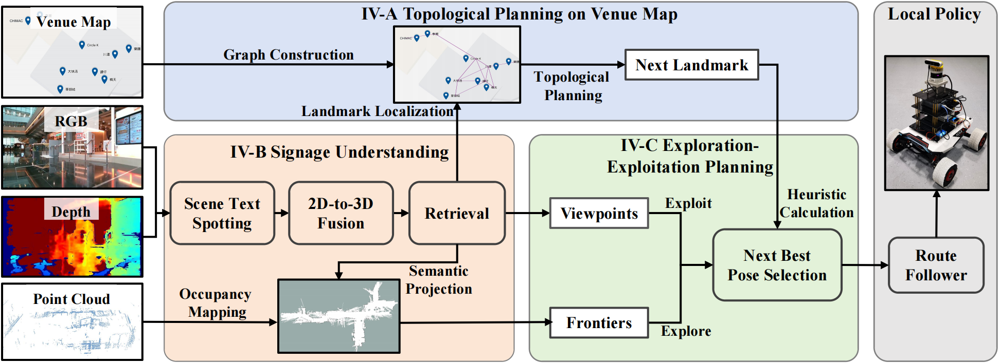

# SignageExplore
(RA-L 2025) [**Signage-Aware Exploration in Open World Using Venue Maps**](https://arxiv.org/pdf/2410.10143)

*Chang Chen, Liang Lu, Lei Yang, Yinqiang Zhang, Yizhou Chen, Ruixing Jia, Jia Pan*

*The University of Hong Kong, Centre for Transformative Garment Production*



## Preparation
This code has been tested on Ubuntu 20.04 with ROS Noetic.


1. Prepare packages
     - Make sure you have installed [miniforge3](https://github.com/conda-forge/miniforge?tab=readme-ov-file) for jetson device,

    - Install [torch-torchvision-jetson](https://forums.developer.nvidia.com/t/pytorch-for-jetson/72048)  
    - (optional) Install [realsense2-jetson SDK](https://github.com/IntelRealSense/librealsense/blob/master/doc/installation_jetson.md)  
    - Install [ompl](https://ompl.kavrakilab.org/core/installation.html)  
    - Then create conda env:
    ```bash
    # three modified submodules: ESTextSpotter, rrt_exploration, distance_map
    git clone https://github.com/chch9907/SignageExplore --recurse-submodules
    
    conda create -n signexp python=3.8
    pip install -r requirements.txt
    ```

2. Prepare ESTextSpotter (customized version)
    ```bash
    cd /scene_understanding/ESTextSpotter
    pip install -r requirements.txt
    cd detectron2-0.2.1
    python setup.py build develop
    cd ../models/ests/ops
    sh make.sh
    ```
    Download model weights from [OneDrive](https://1drv.ms/u/s!AotJrudtBr-K70dUc3W3ly1KI-zZ?e=ed6Drt) to /scene_understanding/ESTextSpotter or your own path defined in the config file.


3. Prepare omcl with python-bindings for global path planner:  

    The installation script for OMPL with py-bindings has been downloaded. Install omple by executing the shell file:
    ``` bash
    ./install-ompl-ubuntu.sh --python 
    ```
    
    - Change python path at -DPYTHON_EXEC in the shell file if needed.  
    - Ompl-1.6.0 requires zipp==1.15.0 and pygccxml==2.2.1, otherwise it will fail to generate bindings!  
    - If still raises errors while making update_bindings: 'FileNotFoundError: [Errno 2] No such file or directory: 'bindings/base':
    See https://github.com/ompl/ompl/issues/1036, git clone the latest ompl github and compile it manually following commands from line 86 to 101 in the install-ompl-ubuntu.sh.

4. Customization
    - Modify necessary params in the [config files](config/scene1.yaml) (e.g., camera intrinsics).
    - For rrr_exploration, define the sampling boundary in [global_rrt_detector.cpp](venue_map_planner/rrt_exploration/src/global_rrt_detector.cpp) and [local_rrt_detector.cpp](venue_map_planner/rrt_exploration/src/local_rrt_detector.cpp). 
    - Then put [venue_map_planner](venue_map_planner) in an individual catkin workspace for compiling and launching it.
    


## Run

1. Offline stage
```bash
# pre-generate pseudo images by landmark names extracted from venue maps
python3 offline_process_diffusion_imgs.py --scene 1

# pre-build topological graphs from venue maps
python3 offline_process_venue_maps.py --scene 1 --ocr_type cnocr

```

2. Online stage
```bash
# run Fast-Lio, Octomap Mapping, Dynamic Pointcloud Filtering, Robot Control, local policy

# run agent.py for signage understanding, semantic mapping, topological localization and planning
conda activate signexp
python3 agent.py --scene 1 --use_camera_topic --plot # --show

# run venue_map_planner for frontier detection, global and local path planning
roslaunch venue_map_planner my_explore.launch
```
## Key scripts in modified submodules
- **ESTextSpotter**: 
  - scene_understand/ESTextSpotter/models/ests/ests.py
  - scene_understand/ESTextSpotter/models/ests/deformable_transformer.py
- **rrt_exploration**: 
  - venue_map_planner/rrt_exploration/scripts/nbvp.py
  - venue_map_planner/rrt_exploration/src/local_rrt_detector.cpp
  - venue_map_planner/rrt_exploration/src/global_rrt_detector.cpp
  - venue_map_planner/rrt_exploration/scripts/local_planner.py
  - venue_map_planner/rrt_exploration/scripts/global_planner.py
  - venue_map_planner/rrt_exploration/scripts/tsp_solver.py
  - venue_map_planner/rrt_exploration/scripts/map_erode.py
  - venue_map_planner/rrt_exploration/scripts/key_params.py
  - venue_map_planner/rrt_exploration/scripts/nav_utils.py
  - venue_map_planner/rrt_exploration/launch/my_explore.launch

## Acknowledgement
[<u>ESTextSpotter</u>](https://github.com/chch9907/ESTextSpotter), [<u>OVIR-3D</u>](https://github.com/shiyoung77/OVIR-3D), [<u>rrt_exploration</u>](https://github.com/hasauino/rrt_exploration), [<u>distance_map</u>](https://github.com/artivis/distance_map), [<u>cnocr</u>](https://github.com/breezedeus/CnOCR)


## Cite
If our paper helps your research, please cite it in your publications:
```bash
@ARTICLE{chen2025signage,
  author={Chen, Chang and Lu, Liang and Yang, Lei and Zhang, Yinqiang and Chen, Yizhou and Jia, Ruixing and Pan, Jia},
  journal={IEEE Robotics and Automation Letters}, 
  title={Signage-Aware Exploration in Open World Using Venue Maps}, 
  year={2025},
  volume={10},
  number={4},
  pages={3414-3421},
  keywords={Text recognition;Robots;Planning;Semantics;Feature extraction;Navigation;Three-dimensional displays;Shape;Location awareness;Image recognition;Autonomous agents;semantic scene understanding;mapping;planning under uncertainty},
  doi={10.1109/LRA.2025.3540390}}
```
